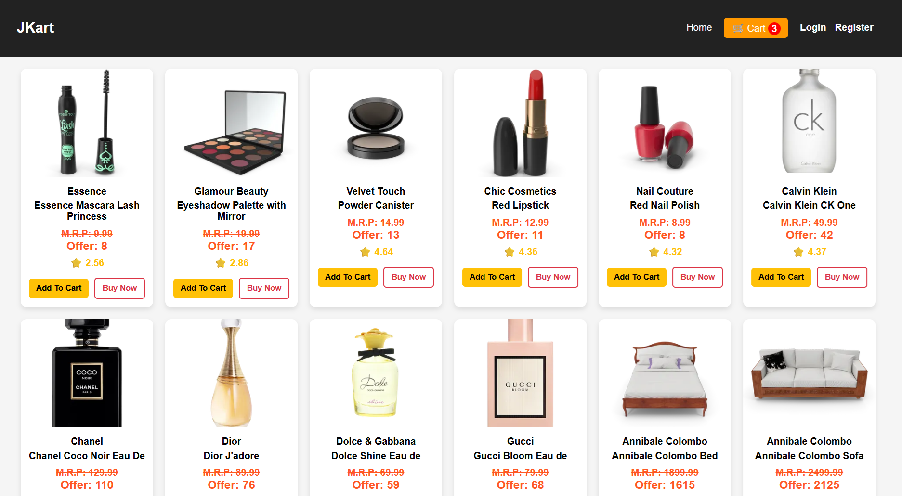
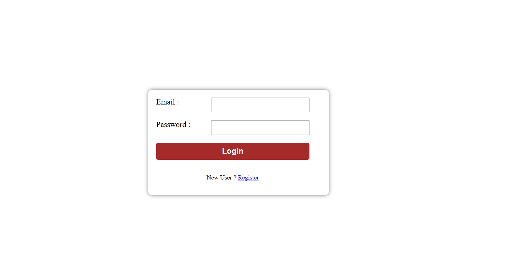
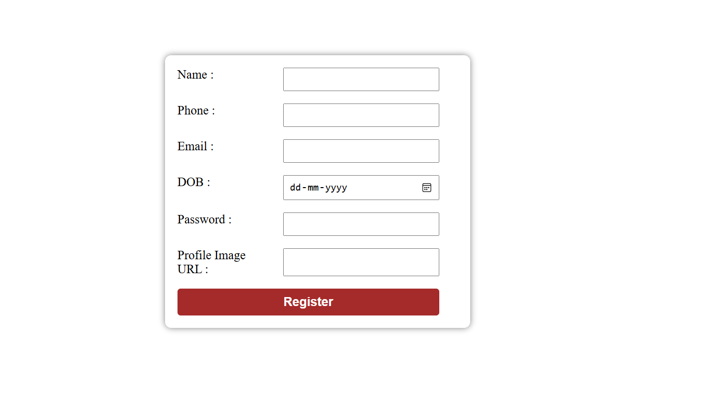
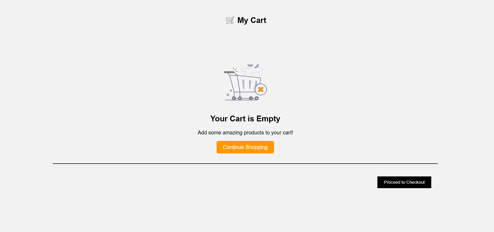
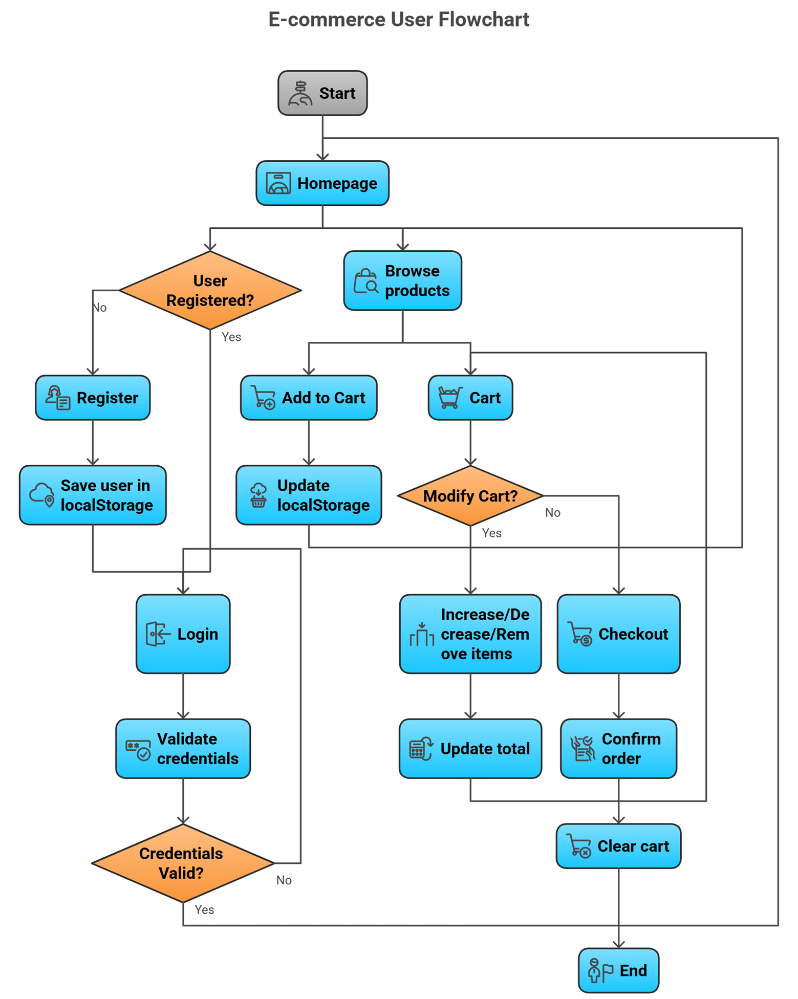

# JKart – JavaScript E-Commerce Application

## Description

JKart is designed as a learning project to practice frontend development skills, simulate e-commerce functionality, and understand the workflow of an interactive web application without relying on a backend.

JKart is a frontend-only e-commerce web application built using HTML, CSS, and JavaScript.
It simulates a real-world online shopping experience, allowing users to register, log in, browse products, add items to a cart, and manage purchases.

This project demonstrates key JavaScript concepts such as DOM manipulation, event handling, localStorage management, conditional rendering, and API integration. It is designed as a learning project for practicing frontend development and understanding the workflow of an interactive web application without a backend.

Users can:
- Register with email and password (with duplicate email validation)
- Log in and log out securely
- Browse products dynamically fetched from an external API
- Add products to their cart and manage quantities
- View real-time cart total and remove items
- Persist data across browser sessions using localStorage

## Live Demo
https://priyanka-0001.github.io/JKart-Ecommerce/

---

## Project Screenshots

### Home Page

### Login Page

### Register Page

### Cart Page

---

## Features

User Authentication
- User registration with duplicate email check
- Duplicate email validation
- Login with credential verification
- Logout functionality

Product System
- Product data fetched from external API
- Dynamic product display
- Add to Cart functionality

Cart System
- Increase/decrease product quantities
- Remove product from cart
- Grand total calculation
- Empty cart message

State Management
- Data persistence using browser localStorage
- Cart count updates in real time
- Track logged-in user

---

## Technologies Used

HTML5 – Page structure  
CSS3 – Styling and layout  
JavaScript (ES6) – Application logic  
Fetch API – Retrieving product data  
localStorage – Client-side data persistence

---

## Key Concepts Used

- DOM Manipulation  
- Event Handling  
- Array methods (`find`, `filter`, `some`)  
- JSON.parse() and JSON.stringify()  
- localStorage CRUD operations  
- Conditional rendering  
- API fetching  
- Page-based logic execution

---

## Project Structure

JKart/
│
├── index.html
├── login.html
│── register.html
├── cart.html
│
├── css/
│   ├── homepage.css
│   ├── login.css
│   ├── register.css
│   └── cart.css
│
├── js/
│   └── jkart.js
│
├── assets/
│   ├── cart.png
│   ├── flowchart.png
│   ├── homepage.png
│   ├── login.png
│   ├── register.png
│   └── workflow.png
│
└── README.md
    
---

## Installation/Setup

1. Clone the repository:
    git clone https://github.com/Priyanka-0001/JKart-Ecommerce.git
2. Open index.html in your browser.
3. No backend or server is required; it runs entirely in the browser.
4. Optional: Deploy to GitHub Pages for a live demo.

---

## How to Use

1. Open homepage.
2. Register a new account or login with existing credentials.
3. Browse products and add to cart.
4. Navigate to Cart page to modify quantities or remove items.
5. Click Checkout to confirm order and clear cart.

---

## Application Flowchart

---

## Application Flow

1. User Registration
    → User enters details → System checks for duplicate email → User data saved in localStorage.

2. User Login
    → Credentials are validated → Logged-in user stored in localStorage → User redirected to homepage.

3. Product Listing
    → Products are fetched from the DummyJSON API → Products displayed dynamically on the homepage.

4. Cart System
    → User adds products to cart → Cart items stored in localStorage → User can update quantity or remove items → Grand total calculated automatically.

5. Checkout
    → User confirms order → Cart is cleared → Process completed.

---

## Future Improvements

- Backend integration 
- User-specific cart system  
- Order history feature  
- Payment gateway integration  
- Improved UI animations  

---
